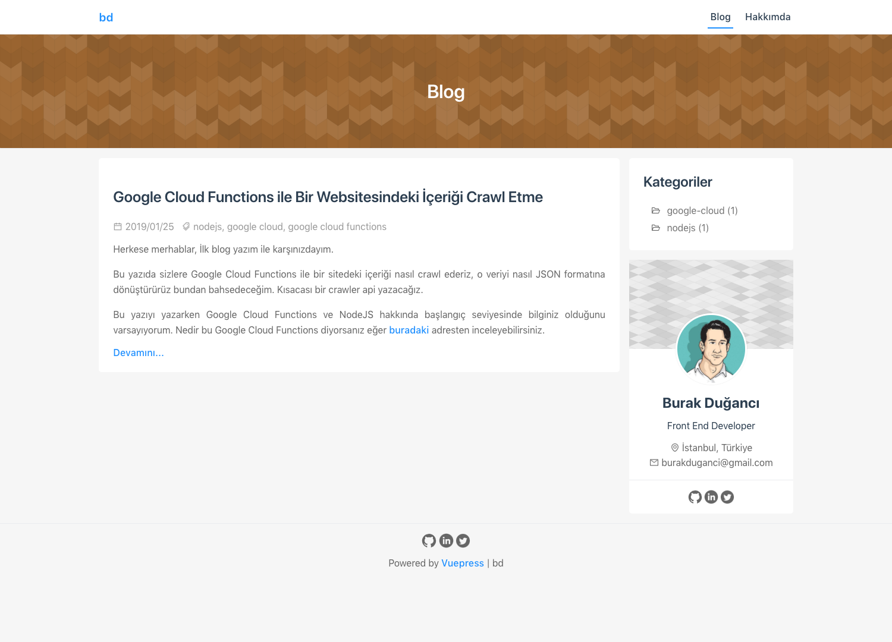

## Puppeteer ile Ekran Görüntüsü Alma Uygulaması
Bu proje [duganci.com](https://duganci.com) adresinde bulunan [Puppeteer İle Websitesinin Ekran Görüntüsünü Alma](https://duganci.com/puppeteer-ile-websitesinin-ekran-goruntusunu-alma/) yazısı içerisinde yazılmıştır.

### Kurulum

Repoyu kopyalıyoruz.
```
git clone git@github.com:burakduganci/puppeteer-screenshot-example.git
```

Kopyaladığımız reponun içerisine giriyoruz.
```
cd puppeteer-screenshot-example
```

Node paketlerimizi yüklüyoruz.
```
npm install
```

Uygulamamızı çalıştırıyoruz.
```
node app.js
```

### Sonuç

